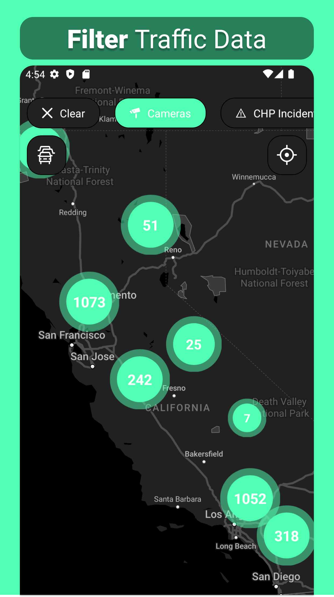
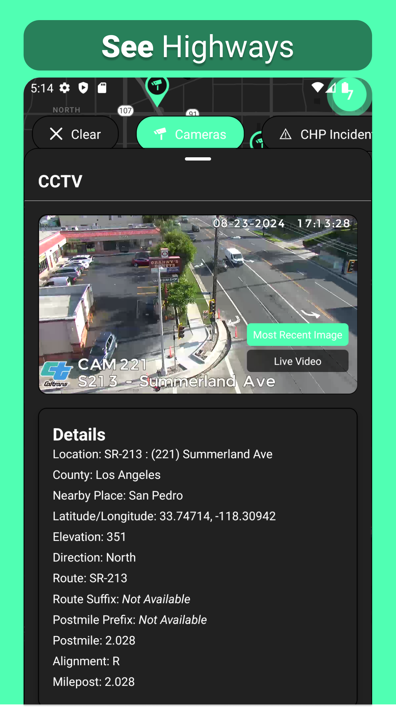
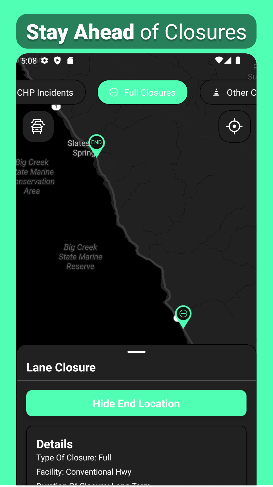
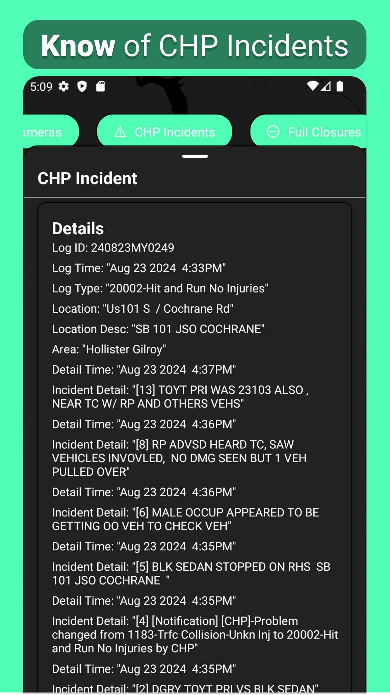
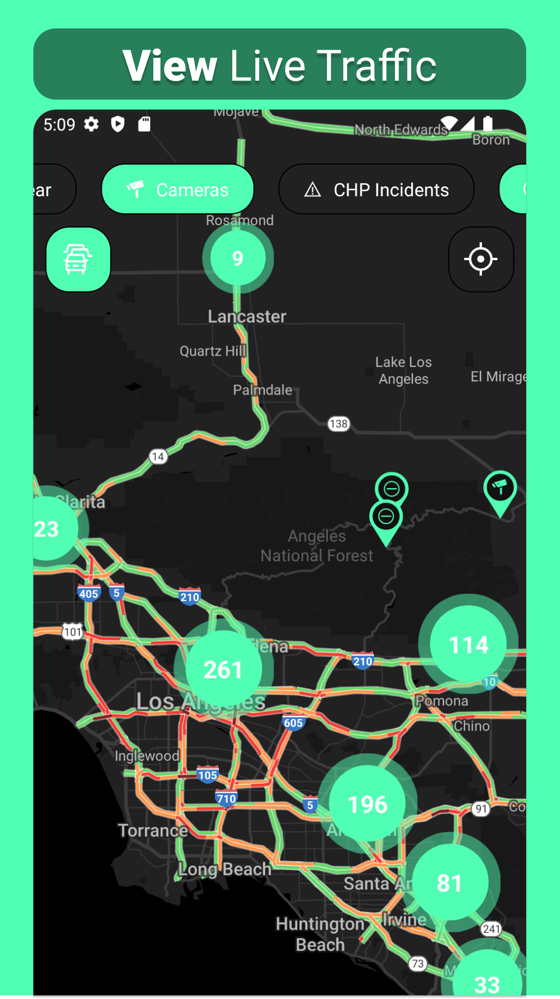
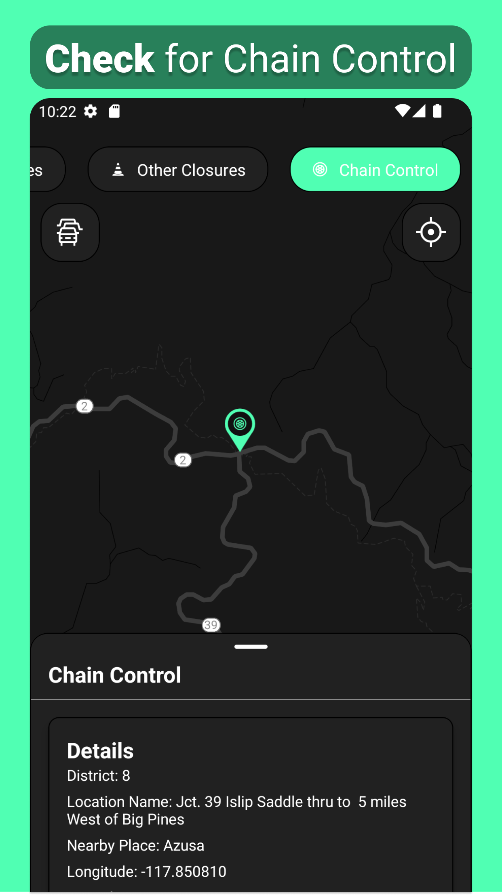
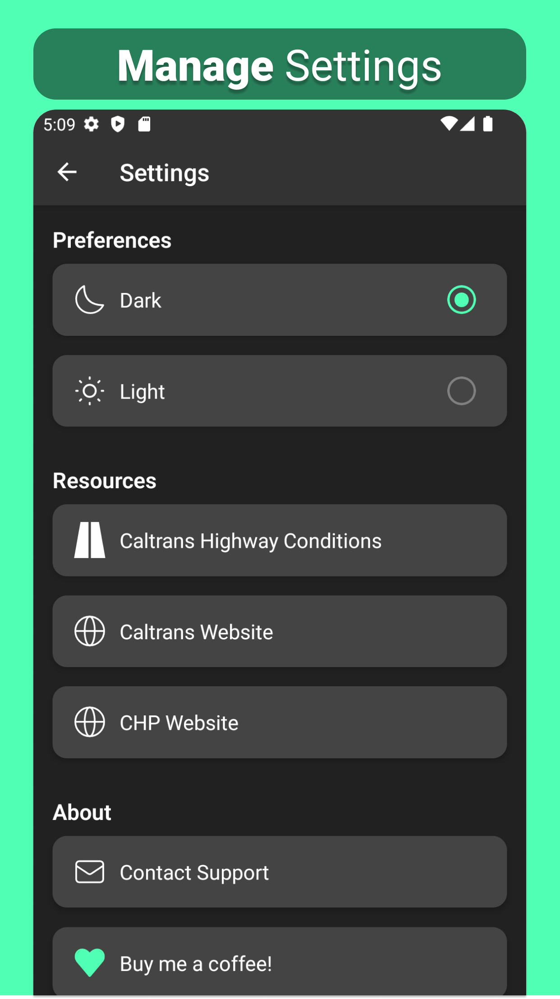

# California Traffic Watch (CTW)
California Traffic Watch is a comprehensive traffic app, designed to provide up-to-date information on highway cameras, CHP incidents, closures, and chain control.

## Android Download
CTW is fully completed, however, it's required to be in closed testing for the time being. If you're interested in trying it out, please follow [these](https://github.com/KallosP/CaliforniaTrafficWatchPreview/blob/main/ANDROID_INSTALL.md) instructions for installation.

## iOS Download
Coming soon...

## Features
- Traffic Cameras: Access a wide range of traffic cameras (some live) from Caltrans across key highways. Stay ahead of traffic conditions and plan your route accordingly.

- Recent CHP Incidents: Get the latest updates on incidents reported by the California Highway Patrol (CHP). View detailed information on accidents, road hazards, and other events that could impact your travel.

- Highway Closures: Stay informed about current road closures. Access detailed closure information along with their start and end points to plan alternative routes and avoid disruptions.

- Chain Control Information: Planning to travel in winter conditions? Check for chain control requirements on major highways before starting your trip.

- Interactive Map: Navigate through a user-friendly, interactive map that allows you 
to filter and click on markers to reveal detailed data on all the previously mentioned information.

- Modern User Interface: Enjoy a simple and modern design that makes it easy to find the information you need.

- Light & Dark Mode: Customize your experience with light and dark mode options, ensuring the app is comfortable to use no matter your preference.

## Screenshots
 

